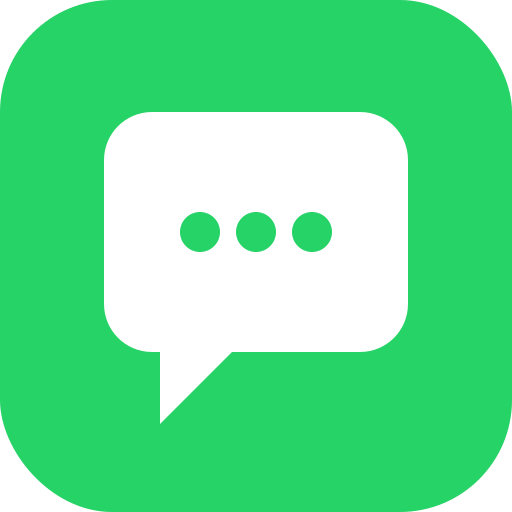

<p align="center">
  
</p>

# WAHA — WhatsApp HTTP API integration for Home Assistant

A custom Home Assistant integration that bridges [WAHA](https://waha.devlike.pro/) (a self-hosted WhatsApp HTTP API) with Home Assistant.

- **Outbound:** send WhatsApp messages via the `waha.send_message` service.
- **Inbound:** every incoming WhatsApp message fires a `waha_message_received` event you can use as an automation trigger. Optionally, the message body can be forwarded to a Home Assistant conversation agent (Assist) so plain-language commands work without writing per-message automations.

## Status

Early/alpha. v0.1.0 — single integration entry, text messages only.

## Requirements

- Home Assistant 2024.12.0 or later.
- A reachable WAHA server (Docker is the typical deployment).
- A started WAHA session (e.g., `default`) authenticated with your WhatsApp account.

## Installation

### Via HACS (custom repository)

1. HACS → 3-dot menu → Custom repositories → add this repo URL, type "Integration".
2. Install "WAHA (WhatsApp HTTP API)".
3. Restart Home Assistant.

### Manual

Copy `custom_components/waha/` into your Home Assistant `config/custom_components/` directory and restart.

## Setup

1. **Settings → Devices & Services → Add Integration → "WAHA (WhatsApp HTTP API)"**.
2. Enter:
   - **WAHA base URL** (e.g., `http://localhost:3000`)
   - **API key** (the value of `WHATSAPP_API_KEY` on the WAHA server, if set)
   - **Session name** (must match a session you've started in WAHA, e.g., `default`)
3. After saving, the integration registers a webhook. Find the URL via:
   **Settings → Devices & Services → WAHA → entry overview** (the webhook ID is stored in the entry).
   The URL pattern is `https://<your-ha>/api/webhook/<webhook_id>`.
4. In WAHA, configure the session's webhooks to POST `message` events to that URL.

## Inbound — `waha_message_received` event

Every received message (excluding ones sent by your own account) fires:

```yaml
event_type: waha_message_received
event_data:
  session: default
  from: "1234567890@c.us"
  body: "Turn on the kitchen light"
  raw: { ... full WAHA payload ... }
  entry_id: <internal>
```

Use it as an automation trigger:

```yaml
trigger:
  - platform: event
    event_type: waha_message_received
    event_data:
      from: "1234567890@c.us"
condition:
  - condition: template
    value_template: "{{ trigger.event.data.body | lower == 'lights off' }}"
action:
  - service: light.turn_off
    target:
      area_id: living_room
```

## Inbound — conversation agent forwarding (optional)

In the integration's **Configure** (options) screen:

- **Forward incoming messages to a conversation agent** — when on, the message body is sent to a conversation agent.
- **Conversation agent ID** — leave blank to use HA's default Assist pipeline, or specify an explicit agent (e.g., `conversation.openai`).
- **Reply with agent's response** — when on, the agent's spoken response is sent back to the original WhatsApp sender.
- **Allowed senders** — comma-separated list of chat IDs (e.g., `1234567890@c.us`). When blank, all senders are allowed. Recommended to set this so random WhatsApp messages can't drive your home.

## Outbound — `waha.send_message` service

```yaml
service: waha.send_message
data:
  chat_id: "1234567890@c.us"
  text: "Front door opened"
```

For groups, use the group chat ID (`...@g.us`).

## Security notes

- The webhook ID is the secret that gates inbound messages. Don't share it.
- Setting **Allowed senders** is strongly recommended if conversation forwarding is enabled — otherwise anyone who learns your WhatsApp number can potentially issue commands.
- Run HA over HTTPS so the webhook URL is not transmitted in clear text.

## License

MIT
